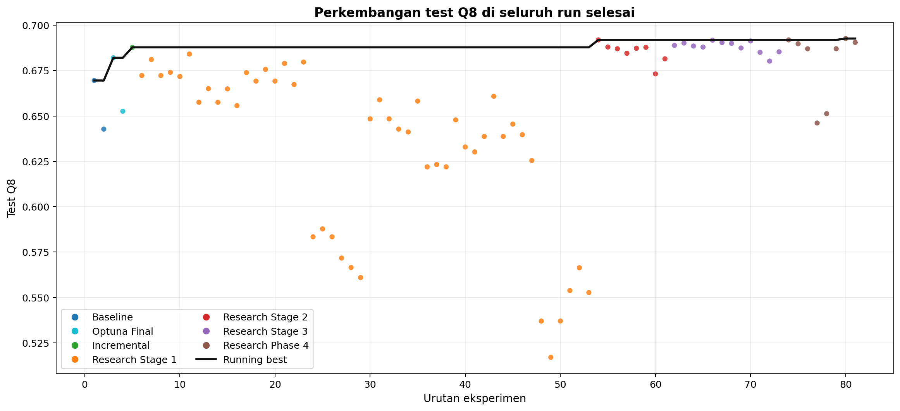
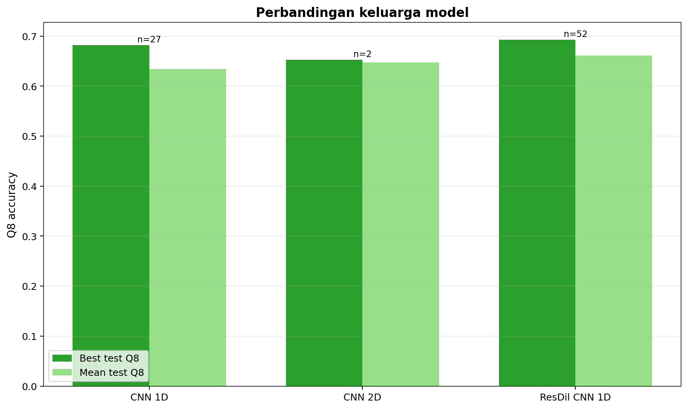

# Protein CNN — Prediksi Secondary Structure Protein pada CullPDB / CB513

Repo ini mendokumentasikan eksperimen berjenjang untuk prediksi **secondary structure protein (Q8)** menggunakan `CullPDB` sebagai sumber train/validation dan `CB513` sebagai **final holdout test set**. Fokus eksperimennya dijaga ketat: mulai dari baseline `CNN 1D` vs `CNN 2D`, lanjut ke `Optuna`, lalu diteruskan ke sweep arsitektur `Residual Dilated CNN 1D` dengan ledger yang lengkap.

Eksperimen akhirnya berkembang menjadi **101 eksperimen tercatat**:

- `81` run selesai dan punya metrik test lengkap
- `16` run `Optuna search` hanya menghasilkan validation metric
- `4` run gagal, tetapi tetap dicatat ke ledger

Hasil resmi terbaik repo saat ini adalah **`p4_07_resdil_b42_ce_none_c320_e24_seed7`** dengan:

- **best validation Q8 = 0.7354**
- **test Q8 pada CB513 = 0.6926**
- **test loss = 0.9242**

Itu berarti hasil akhir sekarang naik **+0.0231 absolute** dibanding baseline `CNN 1D` awal.

---

## Keputusan Final & Angka Resmi

| Komponen | Keputusan |
|---|---|
| Dataset train utama | `cullpdb+profile_5926_filtered.npy.gz` |
| Dataset test final | `cb513+profile_split1.npy.gz` |
| Task | masked `Q8` secondary-structure prediction |
| Input features utama | `baseline42` (`21` amino-acid one-hot + `21` profile features) |
| Arsitektur terbaik | `resdil_cnn1d` |
| Recipe terbaik | `baseline42 + ce + no class weighting` |
| Run final terbaik | `p4_07_resdil_b42_ce_none_c320_e24_seed7` |
| Ledger seluruh eksperimen | [outputs/reports/run_ledger.csv](outputs/reports/run_ledger.csv) |
| Report final lengkap | [outputs/reports/final_report.md](outputs/reports/final_report.md) |

### Metrik resmi

| Run | Best Val Q8 | Test Q8 | Test Loss |
|---|---:|---:|---:|
| Baseline CNN 1D | 0.7061 | 0.6695 | 0.9079 |
| Baseline CNN 2D | 0.6795 | 0.6427 | 0.9919 |
| Tuned CNN 1D | 0.7203 | 0.6820 | 0.8967 |
| Tuned CNN 2D | 0.6914 | 0.6526 | 0.9664 |
| Incremental ResDil Step 1 | 0.7268 | 0.6878 | 0.8872 |
| **Best Final ResDil** | **0.7354** | **0.6926** | **0.9242** |

---

## Perjalanan Eksperimen

### Progres keseluruhan

Grafik pertama merangkum seluruh run yang selesai dan punya metrik test. Setiap titik adalah satu run, dan garis hitam menunjukkan running best.



Sumber data: [outputs/figures/data/protein_cnn_progress_test_q8.csv](outputs/figures/data/protein_cnn_progress_test_q8.csv)

Kalau dilihat dari validation, ada beberapa run yang tampak sangat kuat di split internal, tetapi tidak semuanya generalize ke `CB513`. Itu paling jelas terlihat pada branch `extended46`.


Sumber data: [outputs/figures/data/protein_cnn_progress_best_val_q8.csv](outputs/figures/data/protein_cnn_progress_best_val_q8.csv)

### Dataset & setup evaluasi

File sumber yang dipakai:

- `/workspace/cullpdb+profile_5926_filtered.npy.gz`
- `/workspace/cb513+profile_split1.npy.gz`

Setelah di-reshape, bentuk data menjadi:

- `CullPDB`: `(5365, 700, 57)`
- `CB513`: `(514, 700, 57)`

Setup fitur yang dipakai model:

- `[:, :, 0:21]` = amino-acid one-hot
- `[:, :, 35:56]` = profile features
- total input utama = `42` kanal
- target = `Q8`
- padding dimask saat menghitung loss dan accuracy

Statistik ringkas:

| Split | Protein | Valid Residues | Mean Length | Median Length |
|---|---:|---:|---:|---:|
| CullPDB total | 5365 | 1154412 | 215.2 | 184 |
| CB513 test | 514 | 84765 | 164.9 | 132 |

Keputusan evaluasi yang di-lock:

- validation berasal dari split internal `CullPDB`
- `CB513` dijaga sebagai **test final**
- metrik resmi repo ini adalah masked `Q8 accuracy`

### Baseline dan tuning

Baseline awal langsung memberi sinyal yang jelas:

- `CNN 1D` test Q8 = `0.6695`
- `CNN 2D` test Q8 = `0.6427`
- gap baseline = **+0.0268** untuk `CNN 1D`

Setelah `Optuna`:

- `CNN 1D`: `0.6695 -> 0.6820` (**+0.0125**)
- `CNN 2D`: `0.6427 -> 0.6526` (**+0.0099**)

Tuning membantu kedua model, tetapi tidak mengubah keputusan arsitektur. `CNN 1D` tetap lebih kuat dan lebih layak dijadikan fokus.

### Autoresearch hingga 101 eksperimen

Setelah tuning, eksperimen dilanjutkan secara sequential:

- `research_incremental`: validasi awal `resdil_cnn1d`
- `research_stage1`: sweep feature set, objective, weighting, width, dan branch `cnn2d`
- `research_stage2`: retrain panjang kandidat terbaik
- `research_stage3_confirm`: konfirmasi multi-seed
- `research_phase4`: penajaman akhir pada keluarga `ResDil`

Ringkasan hasil per phase:


Sumber data: [outputs/figures/data/protein_cnn_phase_summary.csv](outputs/figures/data/protein_cnn_phase_summary.csv)

Ringkasan per keluarga model:



Sumber data: [outputs/figures/data/protein_cnn_model_family_summary.csv](outputs/figures/data/protein_cnn_model_family_summary.csv)

Yang paling penting dari dua grafik itu:

- `cnn2d` tidak pernah mendekati ceiling keluarga `1D`
- `cnn1d` menjadi baseline kuat
- `resdil_cnn1d` mengambil alih posisi terbaik repo

### Kandidat terbaik dan stabilitas seed

Family yang benar-benar sehat sepanjang repo adalah:

- `model = resdil_cnn1d`
- `feature_set = baseline42`
- `loss = ce`
- `class_weighting = none`

Saat kandidat ini diuji lintas seed dan schedule, hasilnya tetap rapat di area atas:


Sumber data: [outputs/figures/data/protein_cnn_resdil_candidate_stability.csv](outputs/figures/data/protein_cnn_resdil_candidate_stability.csv)

Top-5 run repo saat ini:

| Rank | Run | Phase | Model | Best Val Q8 | Test Q8 | Test Loss |
|---:|---|---|---|---:|---:|---:|
| 1 | `p4_07_resdil_b42_ce_none_c320_e24_seed7` | Research Phase 4 | ResDil CNN 1D | 0.7354 | 0.6926 | 0.9242 |
| 2 | `s2_01_s1_06_resdil_cnn1d_baseline42_ce_none_c320` | Research Stage 2 | ResDil CNN 1D | 0.7303 | 0.6919 | 0.9327 |
| 3 | `p4_01_resdil_b42_ce_none_c320_e18` | Research Phase 4 | ResDil CNN 1D | 0.7303 | 0.6919 | 0.9327 |
| 4 | `s3_02_s1_02_resdil_cnn1d_baseline42_ce_none_c192_seed13` | Research Stage 3 | ResDil CNN 1D | 0.7307 | 0.6917 | 0.8843 |
| 5 | `s3_03_s1_04_resdil_cnn1d_baseline42_ce_none_c256_seed21` | Research Stage 3 | ResDil CNN 1D | 0.7306 | 0.6913 | 0.9025 |

### Kurva training representatif

Grafik ini memperlihatkan pergeseran baseline → tuned → best final.


Sumber data: [outputs/figures/data/protein_cnn_training_curves.csv](outputs/figures/data/protein_cnn_training_curves.csv)

### Loss vs accuracy

Grafik ini penting untuk membaca eksperimen yang sempat terlihat “loss-nya kecil” tetapi akurasinya tidak menang.


Sumber data: [outputs/figures/data/protein_cnn_test_loss_vs_q8.csv](outputs/figures/data/protein_cnn_test_loss_vs_q8.csv)

Pesan utamanya:

- loss lintas family objective **tidak boleh** dibandingkan mentah
- `sqrt_inverse` dan beberapa varian focal memang bisa terlihat “loss kecil”
- tetapi model resmi tetap harus dipilih dengan `test_q8`, bukan loss semata

---

## Insight Utama

1. **`CNN 1D` menang jelas atas `CNN 2D`.** Ini tidak berubah dari baseline sampai akhir repo.
2. **`Optuna` membantu, tetapi tidak cukup sendirian.** Gain berikutnya datang dari perubahan arsitektur ke `resdil_cnn1d`.
3. **`baseline42` lebih sehat daripada `extended46` untuk generalisasi.** Beberapa run `extended46` mencapai validation Q8 sangat tinggi, tetapi test Q8 justru jatuh.
4. **`ce + no class weighting` adalah jalur terbaik repo.** Family ini mendominasi posisi atas ledger final.
5. **Phase 4 menutup eksperimen dengan hasil resmi terbaik.** Winner final saat ini adalah `p4_07`.

---

## Audit Trail

Artefak utama:

- Ledger final: [outputs/reports/run_ledger.csv](outputs/reports/run_ledger.csv)
- Report final lengkap: [outputs/reports/final_report.md](outputs/reports/final_report.md)
- Status terbaru: [outputs/reports/latest_status.md](outputs/reports/latest_status.md)
- Summary riset: [outputs/reports/research_summary.json](outputs/reports/research_summary.json)
- Summary phase 4: [outputs/reports/phase4_summary.json](outputs/reports/phase4_summary.json)

Artefak model representatif:

- Baseline CNN 1D: [artifacts/cnn1d/report.json](artifacts/cnn1d/report.json)
- Baseline CNN 2D: [artifacts/cnn2d/report.json](artifacts/cnn2d/report.json)
- Tuned CNN 1D: [artifacts/optuna_cnn1d/optuna_report.json](artifacts/optuna_cnn1d/optuna_report.json)
- Tuned CNN 2D: [artifacts/optuna_cnn2d/optuna_report.json](artifacts/optuna_cnn2d/optuna_report.json)
- Best final run: [artifacts/research_runs/p4_07_resdil_b42_ce_none_c320_e24_seed7/report.json](artifacts/research_runs/p4_07_resdil_b42_ce_none_c320_e24_seed7/report.json)

---

## Cara Reproduksi

Baseline `CNN 1D`:

```bash
python train.py \
  --train-path /workspace/cullpdb+profile_5926_filtered.npy.gz \
  --test-path /workspace/cb513+profile_split1.npy.gz \
  --model cnn1d \
  --epochs 5 \
  --batch-size 32 \
  --lr 1e-3 \
  --weight-decay 1e-4 \
  --output-dir artifacts/cnn1d
```

Optuna `CNN 1D`:

```bash
python tune_optuna.py \
  --train-path /workspace/cullpdb+profile_5926_filtered.npy.gz \
  --test-path /workspace/cb513+profile_split1.npy.gz \
  --model cnn1d \
  --trials 8 \
  --epochs 6 \
  --final-epochs 18 \
  --output-dir artifacts/optuna_cnn1d
```

README ini sengaja diposisikan sebagai ringkasan strategis. Analisis lengkap, tabel top-10, pembahasan run gagal, dan interpretasi detail ada di [outputs/reports/final_report.md](outputs/reports/final_report.md).
