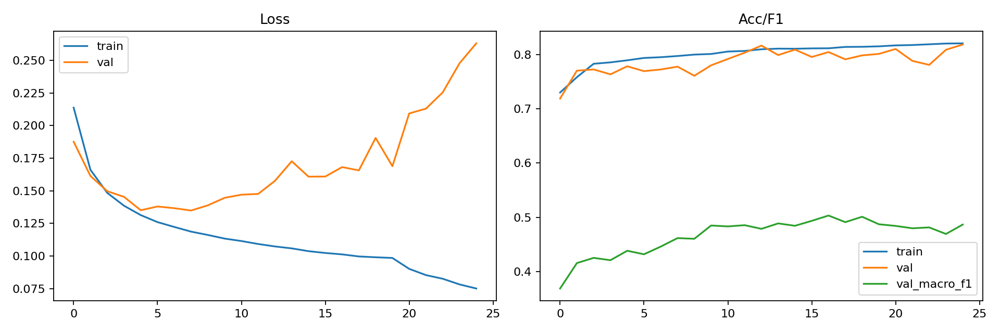
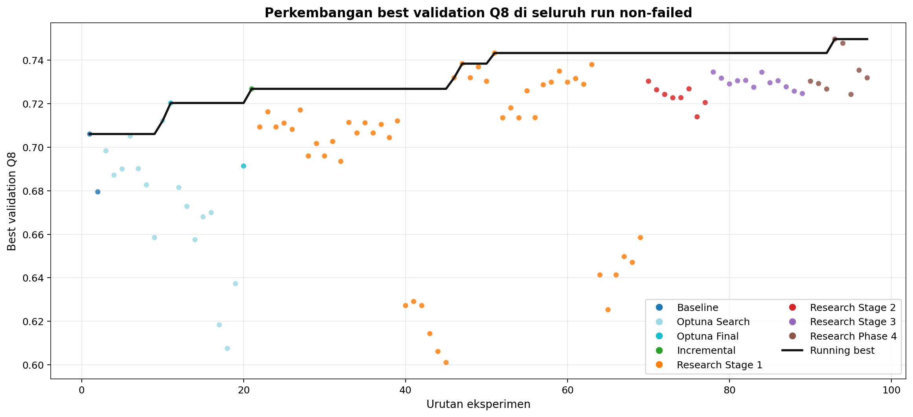
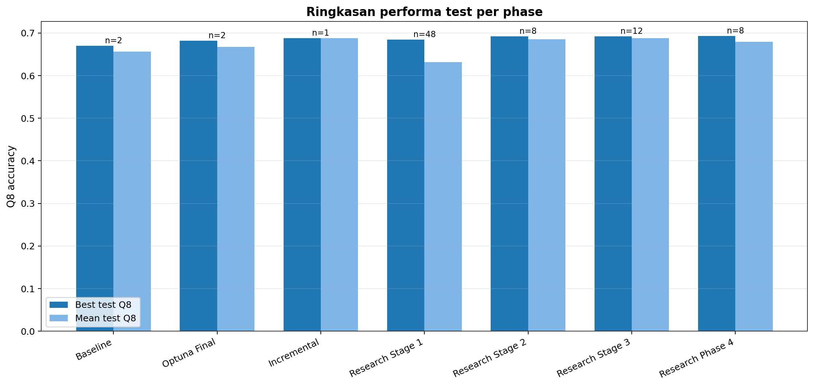
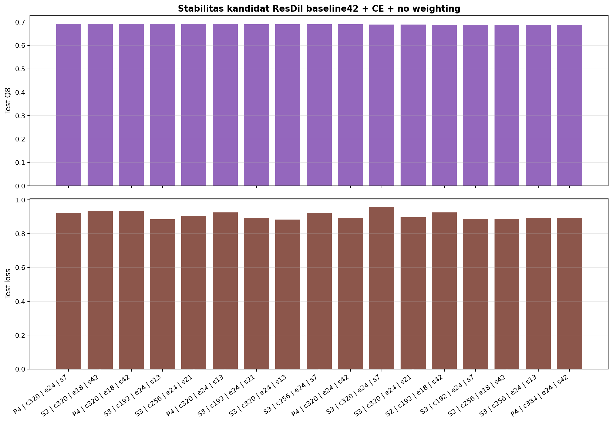
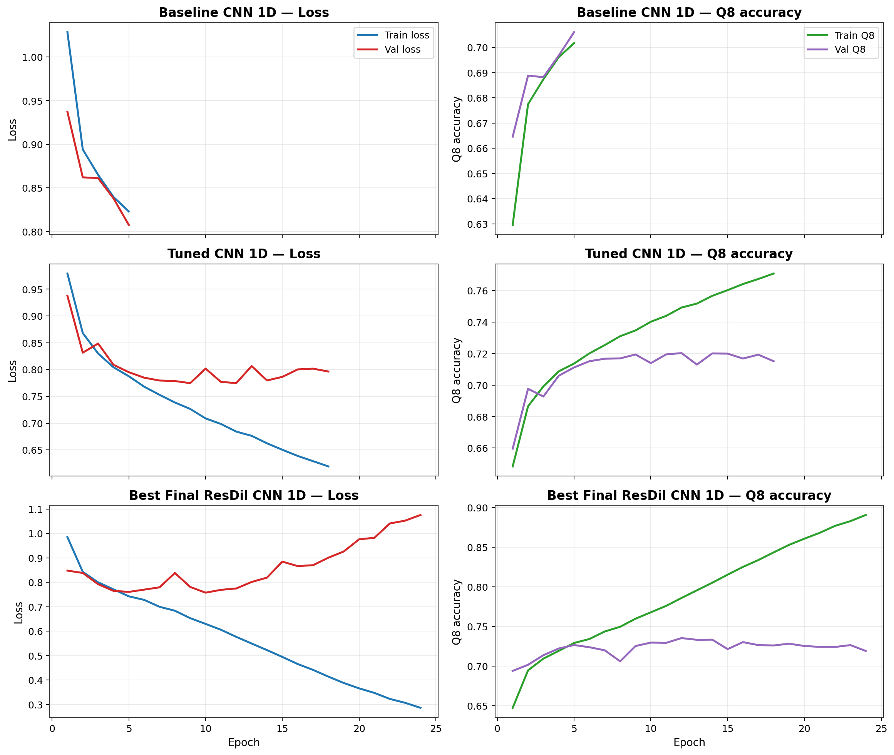
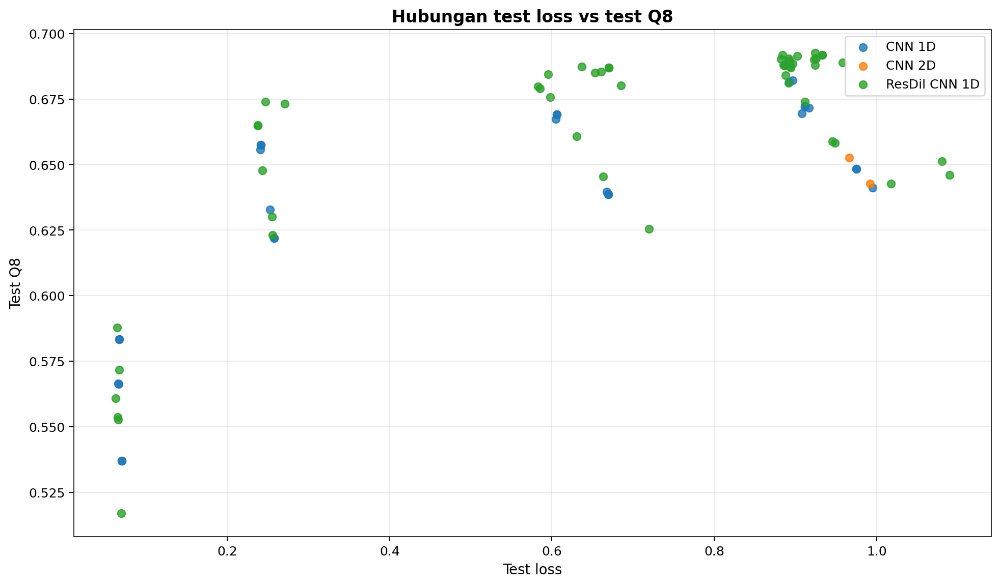

# Protein CNN — Prediksi Secondary Structure Protein pada CullPDB / CB513

Repo ini mendokumentasikan eksperimen prediksi **secondary structure protein Q3** (Helix / Sheet / Coil) dengan pendekatan berjenjang: dari CNN 1D sederhana hingga **ResCNN + BiLSTM + Attention** dengan Optuna hyperparameter search, menggunakan `CullPDB` sebagai train/validation dan `CB513` sebagai holdout test.

Repo juga mencakup eksperimen **Q8** (8-class) yang lebih awal — 101 run tersweep penuh dengan ledger lengkap.

---

## Hasil Final Q3 — ResCNN + BiLSTM + Attention (40 Epoch)

Model terbaik dari percobaan ini adalah **ResCNN + BiLSTM + Attention** yang dilatih 40 epoch menggunakan hyperparameter terbaik dari 18 Optuna trials.

| Metric | Nilai |
|---|---:|
| **Accuracy** | **0.8244** |
| Balanced Accuracy | 0.7017 |
| **Precision (macro)** | **0.5041** |
| **Recall (macro)** | **0.7017** |
| **F1 Score (macro)** | **0.4544** |
| **AUC (OVR)** | **0.9814** |
| Test Loss | 0.0453 |
| Best Val Macro-F1 | 0.5033 |

### Per-Class Performance (CB513)

| Class | Precision | Recall | F1 | Support |
|---|---:|---:|---:|---:|
| 0 — Helix | 1.0000 | 0.8492 | 0.9184 | 340,699 |
| 1 — Sheet | 0.4937 | 0.3482 | 0.4084 | 17,920 |
| 2 — Coil | 0.0185 | 0.9077 | 0.0363 | 1,181 |

> Helix hampir sempurna karena dominasi distribusi (~95% residues). Macro-F1 rendah karena imbalance ekstrem — Helix 340k vs Coil 1.2k.

### Kurva Training




---

## Perjalanan Eksperimen Q3

Empat percobaan dijalankan secara bertahap, masing-masing memperbaiki yang sebelumnya.

| Step | Model | Epoch | Accuracy | F1 (macro) | AUC (OVR) |
|---:|---|---:|---:|---:|---:|
| 1 | CNN 1D baseline | 30 (best ep 12) | 0.8139 | 0.4313 | 0.9484 |
| 2 | CNN + BiLSTM + class weighting | 11 | 0.7942 | 0.4117 | 0.9481 |
| 3 | CNN + BiLSTM + Optuna (tuned weights) | 40 | 0.8138 | 0.4418 | 0.9470 |
| **4** | **ResCNN + BiLSTM + Attention + Optuna** | **40** | **0.8244** | **0.4544** | **0.9814** |

### Step 1 — CNN 1D Baseline Q3

Model CNN 1D sederhana dilatih 30 epoch. Checkpoint terbaik pada **epoch 12** (best val loss).

| Metric | Nilai |
|---|---:|
| Accuracy | 0.8139 |
| Precision (macro) | 0.4195 |
| Recall (macro) | 0.6177 |
| F1 Score (macro) | 0.4313 |
| AUC (OVR) | 0.9484 |
| Loss (best ckpt) | 0.0120 |

Notebook: [`notebooks/results/Protein_1D_Q3.ipynb`](notebooks/results/Protein_1D_Q3.ipynb)

### Step 2 — CNN + BiLSTM dengan Class Weighting

Menambahkan BiLSTM dan class weights untuk mengatasi imbalance. Akurasi turun karena model lebih berusaha memprediksi Sheet/Coil, tapi recall naik.

| Metric | Nilai |
|---|---:|
| Accuracy | 0.7942 |
| Balanced Accuracy | 0.7200 |
| Recall (macro) | 0.7200 |
| F1 Score (macro) | 0.4117 |
| AUC (OVR) | 0.9481 |

Notebook: [`notebooks/results/Protein_Q3_Balanced_CNNBiLSTM.ipynb`](notebooks/results/Protein_Q3_Balanced_CNNBiLSTM.ipynb)

### Step 3 — CNN + BiLSTM + Optuna (40 Epoch)

Menambahkan Optuna tuning pada arsitektur CNN+BiLSTM. Dilatih 40 epoch penuh, disimpan checkpoint terbaik menurut **val macro-F1** (bukan val_loss/val_accuracy).

| Metric | Nilai |
|---|---:|
| Accuracy | 0.8138 |
| Balanced Accuracy | 0.6404 |
| Precision (macro) | 0.4240 |
| Recall (macro) | 0.6404 |
| F1 Score (macro) | 0.4418 |
| AUC (OVR) | 0.9470 |
| Loss | 0.0029 |

Notebook: [`notebooks/results/Protein_Q3_Balanced_CNNBiLSTM (Optuna).ipynb`](<notebooks/results/Protein_Q3_Balanced_CNNBiLSTM (Optuna).ipynb>)

### Step 4 (Final) — ResCNN + BiLSTM + Attention + Optuna (40 Epoch)

Arsitektur diperluas dengan Residual Conv blocks dan Multi-Head Attention. Optuna menjalankan **18 dari 20 trials** (8 epoch/trial), menemukan konfigurasi terbaik pada **Trial 15** (val macro-F1 = 0.5040). Final training 40 epoch.

#### Konfigurasi Terbaik (Trial 15)

| Hyperparameter | Nilai |
|---|---|
| Filters | 128 |
| Conv blocks | 4 |
| Kernel size | 5 |
| LSTM units | 64 |
| Attention heads | 2 |
| Attention key dim | 24 |
| Dense units | 96 |
| Dropout | 0.2542 |
| Learning rate | 8.55e-04 |
| Focal gamma | 1.726 |
| Label smoothing | 0.0348 |
| Batch size | 8 |

Detail 18 trial: [`logs/TRIAL_RESULTS.md`](logs/TRIAL_RESULTS.md)  
Notebook: [`notebooks/results/protein_q3_rescnn_bilstm_attention_optuna.ipynb`](notebooks/results/protein_q3_rescnn_bilstm_attention_optuna.ipynb)

---

## Artefak Q3

| Artefak | Path |
|---|---|
| Test metrics | [results/training/test_metrics.json](results/training/test_metrics.json) |
| Training history | [results/training/final_train_20260426_131406/final_history.json](results/training/final_train_20260426_131406/final_history.json) |
| Model weights | [results/training/final_train_20260426_131406/best_weights.weights.h5](results/training/final_train_20260426_131406/best_weights.weights.h5) |
| Final model | [results/training/final_train_20260426_131406/final_model.keras](results/training/final_train_20260426_131406/final_model.keras) |
| Classification report | [results/training/final_train_20260426_131406/classification_report.txt](results/training/final_train_20260426_131406/classification_report.txt) |
| Optuna trial results | [logs/TRIAL_RESULTS.md](logs/TRIAL_RESULTS.md) |
| Training log | [logs/final_training.log](logs/final_training.log) |

---

## Bagian Tambahan — Q8 Secondary Structure (101 Eksperimen)

Eksperimen Q8 dijalankan lebih awal sebagai sweep arsitektur berjenjang dari **CNN 1D baseline** hingga **Residual Dilated CNN 1D** dengan 101 run tercatat.

### Hasil Terbaik Q8

| Run | Best Val Q8 | Test Q8 | Test Loss |
|---|---:|---:|---:|
| Baseline CNN 1D | 0.7061 | 0.6695 | 0.9079 |
| Baseline CNN 2D | 0.6795 | 0.6427 | 0.9919 |
| Tuned CNN 1D (Optuna) | 0.7203 | 0.6820 | 0.8967 |
| Tuned CNN 2D (Optuna) | 0.6914 | 0.6526 | 0.9664 |
| Incremental ResDil Step 1 | 0.7268 | 0.6878 | 0.8872 |
| **Best Final ResDil** (`p4_07`) | **0.7354** | **0.6926** | **0.9242** |

Gain total Q8: **+0.0231** absolute dari baseline.

### Grafik Progres Q8













### Artefak Q8

- Ledger eksperimen: [results/reports/run_ledger.csv](results/reports/run_ledger.csv)
- Report lengkap: [results/reports/final_report.md](results/reports/final_report.md)
- Best run artifacts: [results/artifacts/research_runs/p4_07_resdil_b42_ce_none_c320_e24_seed7/report.json](results/artifacts/research_runs/p4_07_resdil_b42_ce_none_c320_e24_seed7/report.json)

---

## Cara Reproduksi

**Q3 Final (ResCNN+BiLSTM+Attention + Optuna):**

```bash
python scripts/train_q3.py
```

**Q8 Baseline CNN 1D:**

```bash
python train.py \
  --train-path /workspace/cullpdb+profile_5926_filtered.npy.gz \
  --test-path /workspace/cb513+profile_split1.npy.gz \
  --model cnn1d --epochs 5 --batch-size 32 \
  --lr 1e-3 --weight-decay 1e-4 \
  --output-dir results/artifacts/cnn1d
```

**Q8 Optuna CNN 1D:**

```bash
python tune_optuna.py \
  --train-path /workspace/cullpdb+profile_5926_filtered.npy.gz \
  --test-path /workspace/cb513+profile_split1.npy.gz \
  --model cnn1d --trials 8 --epochs 6 --final-epochs 18 \
  --output-dir results/artifacts/optuna_cnn1d
```
